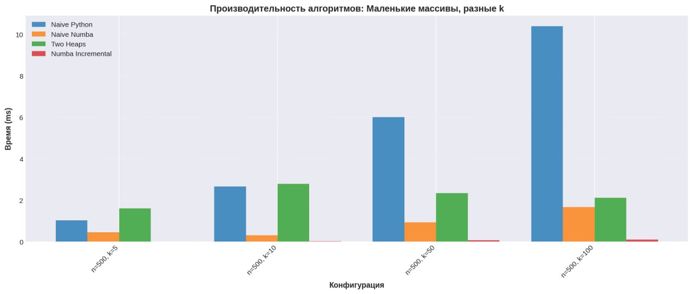
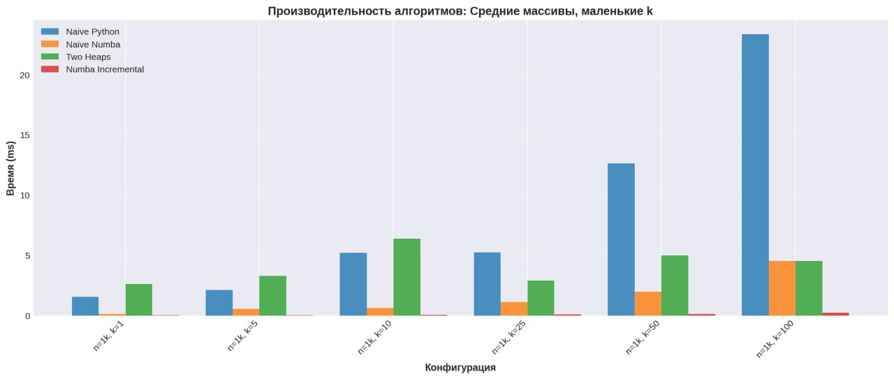
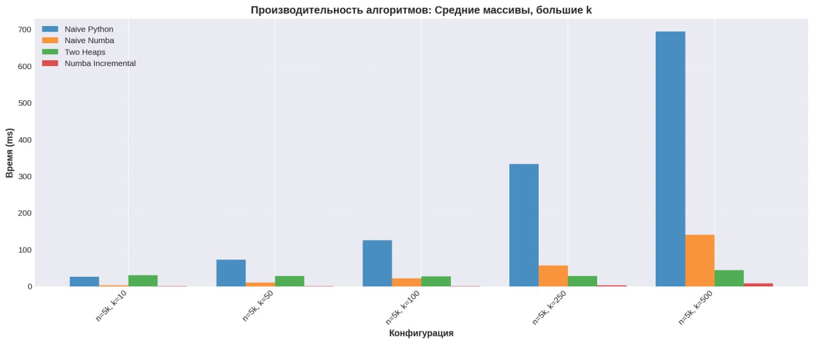
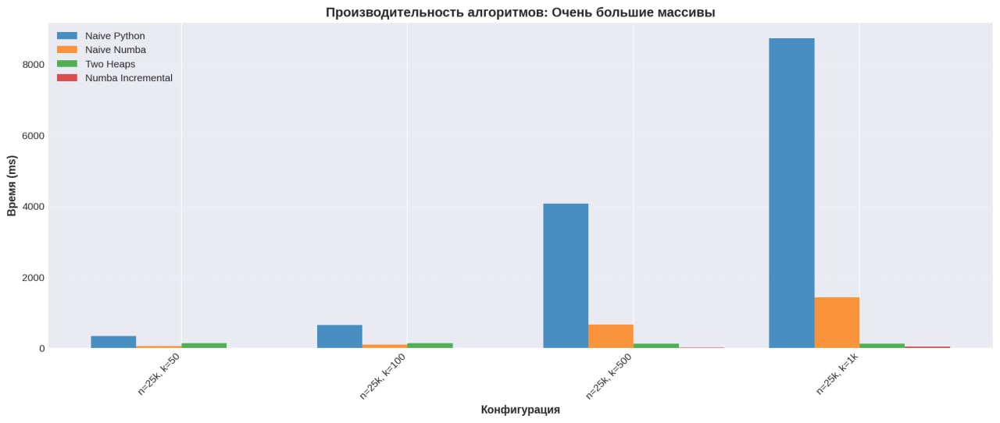

# Sliding Window Median - Анализ производительности алгоритмов

## Результаты бенчмарков

Замеры производились на ноутбуке HP с Windows 11:

|||
|--|--|
|CPU|Ryzen 5 5500U|
|RAM|16Gb|

### 1. Маленькие массивы, разные k (n=500)

### 2. Средние массивы, маленькие k (n=1000)

### 3. Средние массивы, большие k (n=5000)

### 4. Большие массивы (n=10000-25000)

### 5. Экстремальные случаи (логарифмическая шкала)

## Сравнительный анализ

### Производительность по категориям

| Алгоритм | Малые k | Средние k | Большие k | Очень большие k (k ≥ n/2) |
|----------|---------|-----------|-----------|---------------------------|
| **Naive Python** | Плохо | Очень плохо | Неприемлемо | Неприемлемо |
| **Naive Numba** | Приемлемо | Средне | Плохо | Очень плохо |
| **Two Heaps** | Средне | Хорошо | Отлично | **Лучший** |
| **Numba Incremental** | **Лучший** | **Лучший** | **Лучший** | Отлично |

## Заключение

- Эксперименты показали, что **Numba Incremental** является оптимальным выбором для подавляющего большинства практических применений задачи скользящей медианы. Её производительность в десятки и сотни раз превосходит наивные реализации
- **Two Heaps** остается важной альтернативой для специфических случаев с очень большими окнами (k ≥ n/2), где её O(n log k) сложность дает теоретическое и практическое преимущество

Реализация алгоритма Numba Incremental: в [main.py](main.py)
Реализация алгоритма Two Heaps: в [main.py](main.py)
